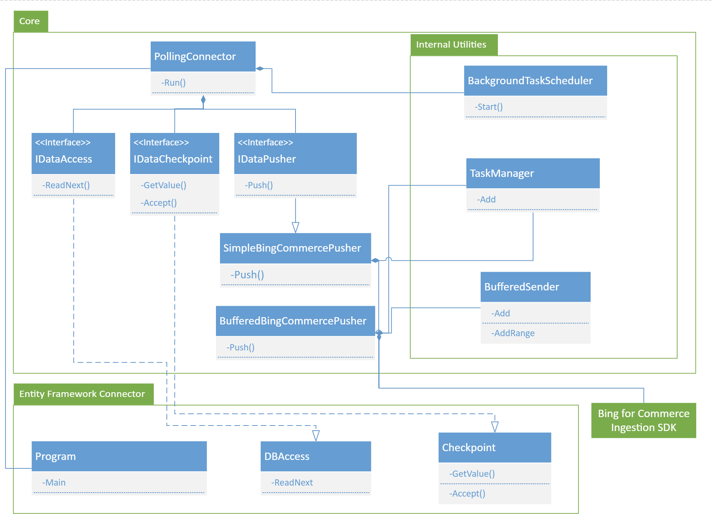

# Table of Contents

* ### [Introduction](#bing-for-commerce-connector).
* ### [Architecture](#architecture).
* ### [Classes](#classes).
* ### [Characteristics](#connector-characteristics).
  * #### [Polling Connector](#polling-connector)
  * #### [Simple Bing Commerce Pusher](#simple-bing-commerce-pusher) 
  * #### [Buffered Bing Commerce Pusher](#buffered-bing-commerce-pusher)
* ### [Entity Framework Connector](#entity-framework-connector)
  * #### [Sample SQL Server database setup](#sample-sql-server-database-setup)

# Bing for Commerce Connector

This document covers the Bing for Commerce Connector design, and how developers can integrate with the connector core in order to create new connectors with new data sources. The document will also explain how the Entity Framework Connector was built in top of the connector core to create a connector that polls data from any Entity Framework Core supported engine.

# Architecture



# Classes

* ### [Core Classes](./Classes/Core-Classes.md).
* ### [Core Interfaces](./Classes/Core-Interfaces.md).
* ### [Serializers](./Classes/Serializers.md).
* ### [Config](./Classes/Core-Config.md).
* ### [Utility Classes](./Classes/Utility-Classes.md).

# Connector Characteristics

## Polling Connector

When we run the polling connector, the connector will do the following:

1. Start a poll from the given checkpoint to make sure it's up to date.
2. Schedule a recurring task to run every certain amount of time as configured (e.g. every minute if configured to `00:01:00`).

**Remarks:** The connector scheduler will only run one poll at a time. So, if the pervious poll was already running when another one is scheduled, the new one will be skipped.

## Simple Bing Commerce Pusher

This is a simple basic pusher that can be used to push data to your Bing for Commerce index, with the ability to limit the number of concurrent requests to the Bing server, as well as the option to specify the maximum number of records per push request. This is deigned to work best with the Polling Connector. When run the pusher will do the following:

1. Use the data source to enumerate new records after the given checkpoint.
2. If the number of records passed the allowed maximum, shard them to separate requests that each won't pass that configuration.
3. After all each request completes, accept its latest checkpoint.

For added hardening of the connector, it supports:

* **Retry options:** The pusher retries sending the push requests a configurable number of times before failing the request completely.
* **Logging the failures:** For failed requests, you'll have the option to turn on deadletter logs, which would log the full request bodies for the records that failed to ingest to the Bing for Commerce backend for any reason, which you can do a scheduled log puller job to upload these somewhere where you can use them to take action upon them.

## Buffered Bing Commerce Pusher

This is created mostly for an added support for event based connector scenarios. You can consider this as a wrapper around the Bing for Commerce  ingestion client push apis, with a couple of additions:

* It adds the capability of buffering your data updates, so that it would send fewer, bigger batches to the service, rather than sending one record update at a time, which can help you achieve a higher throughput.
* The wrapper retries to send the request a configurable amount of times before failing completely.
* It provides the option for consumers of the pusher to log the full body of the failed requests, which you can apply a scheduled poll so that you'd know which records have failed to be pushed to the Bing for Commerce backend for any reason (maybe incompatible format, or wrong configurations) and take action upon those.

## Connectors Best practices

* In order to make sure your connector is running properly, we recommend you should enable the deadletter request logs, and schedule a log pull job for the deadletter directory, so that you can take action on any failed requests if needed.
* Since we want to make sure that the connector doesn't silently fail a schedule, the connector would not catch any exception reported by the data reader implementation for the specific connector. You will need to make sure to properly handle that on the connector implementation side in a way that can enable you to take action on failure.
* 


# Entity Framework Connector

This Connector is built using the polling connector, which polls new data updates every certain interval of time. For that it implements a data reader which retrieves all records after a certain checkpoint. The connector will be expecting a few configurations from the consumer:

* **ConnectionString:** The Entity Framework compatible connection string to your database.
* **Server:** The Server type. currently supports Sql Server, My Sql, Postre Sql and Sqlite.
* **SqlStatement:** The sql statement to poll all the data from the server at the first run.
* **UpdateSqlStatement:** The sql statement to poll the updated data after a given checkpoint.
* **CheckpointColumn:** The name of the checkpoint column. This will serve as a way for the connector to keep it up to date, and to make sure it's not used in the data pushed to the Bing for Commerce backend.
* **CheckpointFile:** The file path to where you need the checkpoint data to be stored at.

## Sample SQL Server database setup

### Data Setup

* **Create The Database:** 
```SQL
CREATE DATABASE [MyTestDatabase]
```
* **Create the Table**:
```SQL
CREATE TABLE [dbo].[MyTestTable]
(
    [Id] INT NOT NULL PRIMARY KEY,
    [Title] NVARCHAR(200) NOT NULL,
    [Description] NVARCHAR(max) NOT NULL,
    [Price] NUMERIC(18) NOT NULL,
    [ModifiedDate] DATETIME       DEFAULT (getdate()) NOT NULL -- For timestamp approach.
)
```
* **Enable Change Tracking for the Database (Change Tracking approach):**
```SQL
ALTER DATABASE [MyTestDatabase] SET CHANGE_TRACKING = ON (CHANGE_RETENTION = 7 DAYS, AUTO_CLEANUP = ON)
```
* **Enable Change Tracking for the Table (Change Tracking approach):**
```SQL
ALTER TABLE [MyTestTable] ENABLE CHANGE_TRACKING WITH (TRACK_COLUMNS_UPDATED = ON)
```

* **Add Mofified Timestamp trigger (Timestamp approach):**
```SQL
CREATE TRIGGER [trgYourTableModified]
    ON [dbo].[MyTestTable]
    FOR UPDATE
    AS
    BEGIN
        UPDATE [dbo].[MyTestTable]
        SET [ModifiedDate] = SYSDATETIME()
        FROM inserted i
        WHERE i.Id = [dbo].[MyTestTable].[Id]
    END
```

### Sample Connector Configuration (Timestamp)

```yaml
ConnectorConfig:
    ScanCadence: '00:10:00' # Scan the Database once every 10 minutes.

PushConfig:
    TenantId: 'My Tenant id'
    IndexId:  'My Index id'
    AccessToken: 'My Access Token'
    PushFormat: JsonArray
    MaxBatchCount: 100
    MaxRequestSize: 0
    MaxConcurrentRequests: 100
    RequestLog: DeadletterOnly
    RequestLogLocation: './log'
    TrackingCadence: '00:00:00' # No tracking requested
    RetryCount: 3

DatabaseConfig:
    ConnectionString: 'My SQL SERVER CONNECTION STRING'
    Server: 'SqlServer'
    SqlStatement: 'SELECT [MyTestTable].Id,[MyTestTable].Title,[MyTestTable].Description,[MyTestTable].Price, [ChangeTable].ModifiedDate FROM [MyTestTable]'
    UpdateSqlStatement: 'SELECT [MyTestTable].Id,[MyTestTable].Title,[MyTestTable].Description,[MyTestTable].Price, [ChangeTable].ModifiedDate FROM [MyTestTable] WHERE [MyTestTable].ModifiedDate >= @CHECKPOINT'
    CheckpointColumn: 'SYS_CHANGE_VERSION'
    CheckpointFile: './CHECKPOINT'
```

### Sample Connector Configuration (Change Tracking)

```yaml
ConnectorConfig:
    ScanCadence: '00:10:00' # Scan the Database once every 10 minutes.

PushConfig:
    TenantId: 'My Tenant id'
    IndexId:  'My Index id'
    AccessToken: 'My Access Token'
    PushFormat: JsonArray
    MaxBatchCount: 100
    MaxRequestSize: 0
    MaxConcurrentRequests: 100
    RequestLog: DeadletterOnly
    RequestLogLocation: './log'
    TrackingCadence: '00:00:00' # No tracking requested
    RetryCount: 5

DatabaseConfig:
    ConnectionString: 'My SQL SERVER CONNECTION STRING'
    Server: 'SqlServer'
    SqlStatement: 'SELECT [MyTestTable].Id,[MyTestTable].Title,[MyTestTable].Description,[MyTestTable].Price, [MyTestTable].SYS_CHANGE_VERSION FROM [MyTestTable] INNER JOIN CHANGETABLE(CHANGES [MyTestTable], 0) AS [ChangeTable] ON [MyTestTable].Id = [ChangeTable].Id'
    UpdateSqlStatement: 'SELECT [MyTestTable].Id,[MyTestTable].Title,[MyTestTable].Description,[MyTestTable].Price, [ChangeTable].SYS_CHANGE_VERSION FROM [MyTestTable] INNER JOIN CHANGETABLE(CHANGES [MyTestTable], @CHECKPOINT) AS [ChangeTable] ON [MyTestTable].Id = [ChangeTable].Id'
    CheckpointColumn: 'SYS_CHANGE_VERSION'
    CheckpointFile: './CHECKPOINT'
```

### How the Entity framework data reader works

1. Check the checkpoint if it's valid.
2. If valid, use the 'UpdateSqlStatement' and bind `@CHECKPOINT` to the current checkpoint. Otherwise just use 'SqlStatement' to query for the data.
3. On each returned record, set the checkpoint value, construct the dictionary with the fields values (minus the checkpoint column), and return the records.

### Your Database engine supported by Entity Framework Core, but not listed here?

The connector have encorporated quite a few database engines supported by the Entity Framework Core. However, since the Entity Framework Core drivers support keeps growing, and since trying to match different version requirements for different drivers can be tricky, we have only built in the support for the following database engines to begin with: *Sql Server, My Sql, Postgre Sql and Sqlite. 

If you need another database engine support, please feel free to fork this codebase, import the Entity Framework driver package of you choice, add support for it in [dbContextMap](../EntityFrameworkConnector/DBAccess.cs), and that should be all you need.
